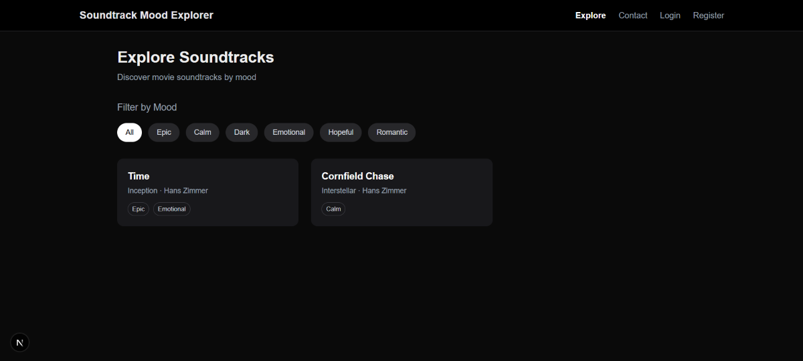
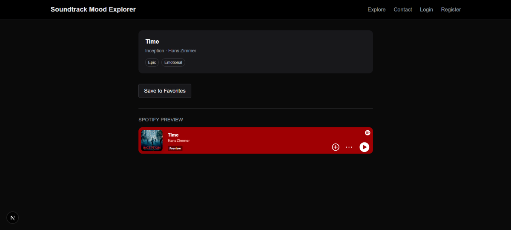
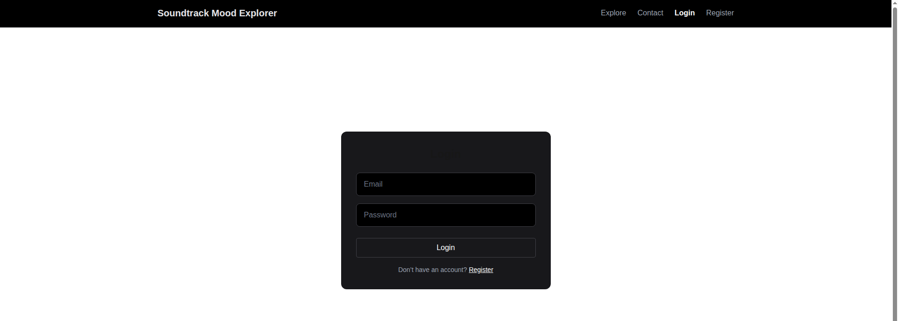

# 🎬 Soundtrack Mood Explorer — Frontend
Frontend application for the Soundtrack Mood Explorer project.

This application allows users to:
- Discover movie soundtracks
- Filter by mood
- View detailed soundtrack information
- Preview tracks via Spotify
- Register & login
- Save favorites
Built as a full-stack portfolio project.

## 🚀 Features
- 🎵 Browse soundtracks
- 🔍 Dynamic soundtrack detail pages
- ⭐ Add / remove favorites
- 🔐 JWT-based authentication
- 🎧 Spotify preview integration
- ♿ Accessible UI (ARIA roles, focus management)
- 💅 Clean responsive design (Tailwind CSS)

## 📸 Screenshots

### Explore Page


### Soundtrack Detail with Spotify Preview


### Favorites Page


### Login Page


## 🛠 Tech Stack
- Next.js (App Router)
- React
- TypeScript
- Tailwind CSS
- JWT Authentication
- REST API communication

## 🔗 Backend Requirement
The frontend requires the backend API to be running.

Backend repository:
👉 `soundtrack-mood-explorer-backend`

Backend must run on:
```
http://localhost:3000
```
The frontend runs on:
```
http://localhost:3001
```

## 🌍 API Configuration
The frontend communicates directly with the backend using:
```
http://localhost:3000/api
```
No frontend environment variables are required for local development.

Earlier versions used an environment variable (`NEXT_PUBLIC_API_URL`), but this was removed to simplify configuration and avoid cross-origin inconsistencies between development environments (Linux vs Windows).

## ▶️ Running the Frontend
Install dependencies:
```
npm install
```
Start development server:
```
npm run dev
```
Open:
```
http://localhost:3001
```

## 🔐 Authentication Strategy
Authentication is implemented using JWT stored in localStorage.

- Token is saved after login.
- Protected pages (`/favorites`, `/profile`) check authentication client-side.
- If not authenticated, users are redirected to `/login`.

A previous server-side proxy middleware was removed because it expected cookie-based authentication and conflicted with the chosen localStorage-based JWT strategy.

For production, authentication should be migrated to secure httpOnly cookies.

## 🌱 Seeding the Database (Important for Testing)
To populate demo data including Spotify previews:
1. Start the backend.
2. Open browser console.
3. Run:
```
fetch("http://localhost:3000/api/seed", { method: "POST" })
  .then(res => res.json())
  .then(console.log);
```
Expected response:
```
{ "message": "Database seeded" }
```
This inserts demo soundtracks with valid Spotify track IDs.

## 🎧 Spotify Preview
Soundtracks may include a `spotifyTrackId`.

If present, a Spotify embed player is displayed on the detail page.

If not present, a fallback message is shown.

 ## 📁 Project Structure
 ```
src/
 ├── app/
 │    ├── explore/
 │    ├── soundtrack/[id]/
 │    ├── favorites/
 │    ├── profile/
 │    ├── login/
 │    └── register/
 ├── components/
 ├── services/
 └── utils/
 ```
## 🏷 Version
Current frontend version:
```
v1.2.0
```

### v1.2.0 Updates
- Stabilized API configuration
- Removed incompatible proxy middleware
- Fixed cross-platform development issue (Linux vs Windows)
- Enabled Spotify preview support
- Updated documentation
- Added clear seeding instructions

## 🧠 Architecture Notes
This project uses:

- Separate frontend and backend repositories
- REST API communication
- Client-side route protection
- MongoDB via backend API

Designed to demonstrate real-world full-stack development concepts.

## 🧩 Future Improvements
- Server-side auth with httpOnly cookies
- Pagination and filtering
- Deployment (Vercel + MongoDB Atlas)
- Dark/light theme toggle
- Improved error handling

## 👨‍💻 Author

Frantisek Babinsky

Junior Full-Stack Developer  

Built as a professional portfolio project.