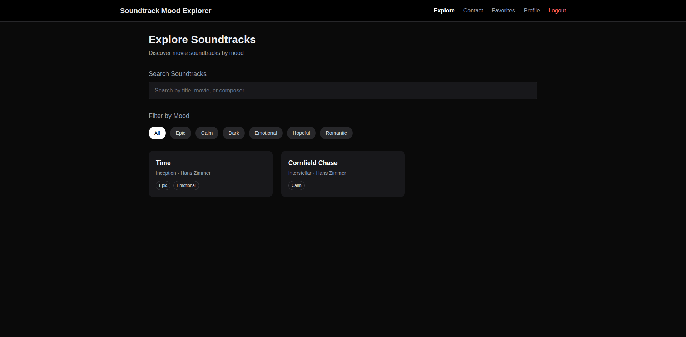
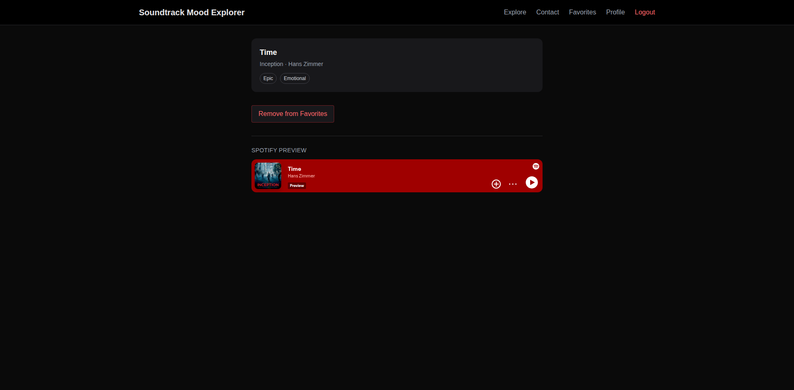
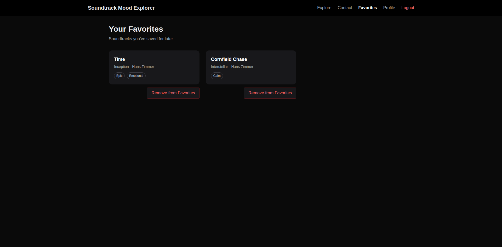
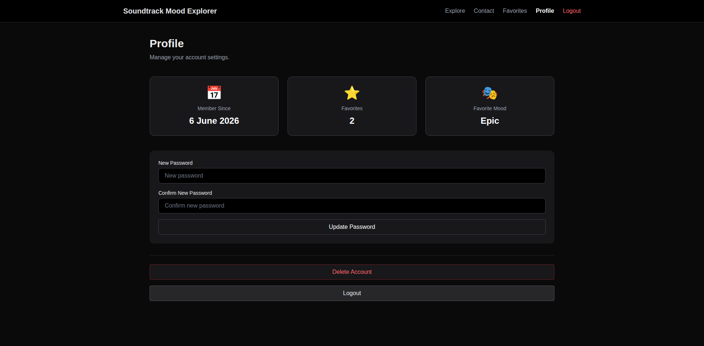
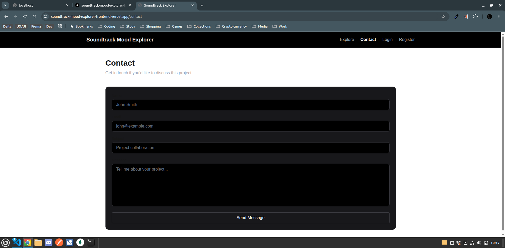

# 🎬 Soundtrack Mood Explorer — Frontend


Frontend application for Soundtrack Mood Explorer, a full-stack portfolio project for discovering and organizing movie soundtracks by mood.

This application allows users to:

- Discover movie soundtracks
- Filter by mood
- View detailed soundtrack information
- Preview tracks via Spotify
- Register & login securely
- Save and manage favorites
- View personal profile statistics
- Contact the developer through a built-in contact form

Built as a modern full-stack portfolio project showcasing secure authentication, responsive UI design, accessibility, and REST API integration..

---

## 🚀 Features

- 🎵 Browse movie soundtracks
- 🔍 Search by title, movie or composer
- 🎭 Filter by mood
- ⭐ Persistent favorites
- 👤 Profile statistics
- 📬 Contact form with email delivery
- 🔐 Secure authentication
- 🎧 Spotify preview integration
- ♿ Accessible UI
- 📱 Responsive design
- 🎨 Consistent Heroicons throughout the UI
- ✨ Smooth card hover animations
- ⏳ Improved loading skeletons

---

## 🚀 Deployment

- Frontend: Vercel
- Backend: Vercel
- Database: MongoDB Atlas
- Email: Resend

Authentication uses secure httpOnly cookies with cross-origin support.

---

## 🌐 Live Demo

- **Frontend:** https://soundtrack-mood-explorer-frontend.vercel.app
- **Backend API:** https://soundtrack-mood-explorer-backend.vercel.app

---

## 🔐 Authentication (v1.4.0)

Authentication is now implemented using **httpOnly cookies**:

- Token is stored securely in a cookie (not accessible via JS)
- All requests use `credentials: "include"`
- Protected pages validate auth via backend (`/api/user/me`)
- Logout clears cookie server-side

👉 This replaces the previous `localStorage`-based approach and aligns with production best practices.

---

## 🌐 Browser Compatibility

Verified during development on:

- Google Chrome (Linux)
- Google Chrome (Windows)
- Safari (iOS)

The application is built using modern web standards and is expected to work in other current Chromium-based browsers, but only the browsers listed above have been verified.

### Note

Safari's Intelligent Tracking Prevention (ITP) applies stricter rules to cross-site authentication cookies. Some Safari configurations may require privacy settings to be adjusted during testing.

---

## ⭐ Favorites

- Add and remove favorites
- Persistent across sessions
- Synced with MongoDB
- Real-time UI updates

---

## 📸 Screenshots

### Explore Page



### Soundtrack Detail



### Favorites Page



### Profile Page



### Contact Page



---

## 🛠 Tech Stack

- Next.js (App Router)
- React
- TypeScript
- Tailwind CSS
- Heroicons
- Jest
- React Testing Library
- REST API communication
- Resend
- Vercel

---

## 🌍 Environment Configuration

Development:

```
Backend: http://localhost:3000
```

```
Frontend: http://localhost:3001
```

Production:

```
Backend: https://soundtrack-mood-explorer-backend.vercel.app
```

```
Frontend: https://soundtrack-mood-explorer-frontend.vercel.app
```

---

## 🌍 API Configuration

Development:

```
http://localhost:3000/api
```

Production:

```
https://soundtrack-mood-explorer-backend.vercel.app/api
```

All authenticated requests include:

```
credentials: "include"
```

---

## ▶️ Running the Frontend

```bash
npm install
npm run dev
```

Open:

```
http://localhost:3001
```

---

## 🧪 Testing

This project uses **Jest** and **React Testing Library** for frontend unit testing.

Run the test suite:

```bash
npm test
```

Run the test suite with code coverage:

```bash
npm run test:coverage
```

The current test suite includes reusable UI components, with additional tests for services, utilities, and integration scenarios planned for future releases.

---

## 🌱 Seeding the Database

```js
fetch("http://localhost:3000/api/seed", { method: "POST" })
  .then((res) => res.json())
  .then(console.log);
```

---

## 📁 Project Structure

```
src/
 ├── app/
 ├── components/
 ├── services/
 └── utils/
```

---

## 🏗 Architecture

```text
User
  │
  ▼
Next.js Frontend
  │
  ▼
REST API
  │
  ▼
Next.js Backend
  │
  ▼
MongoDB Atlas
```

---

## 🏷 Version

Current version:

```
v1.9.0
```

---

## ✨ Current Highlights

- 🔍 Search soundtracks by title, movie, or composer
- 🎭 Combined search and mood filtering
- ⭐ Persistent favorites synchronized with MongoDB
- 👤 Profile statistics dashboard
- 📬 Functional contact form with email delivery
- 📅 Member Since information
- 🎼 Favorite count and most common mood
- 🧩 Reusable StatCard component
- 🔐 Secure authentication using httpOnly cookies
- 🎧 Spotify preview integration
- ♿ Accessible, keyboard-friendly interface
- 📱 Responsive design for desktop and mobile
- 🎨 Consistent Heroicons across reusable UI components
- ✨ Refined soundtrack card hover animations
- ⏳ Improved skeleton loading experience
- ♿ Enhanced accessibility for profile statistics
- 🧪 Automated component testing with Jest and React Testing Library

---

## 🧩 Future Improvements

Future improvements are tracked through GitHub Issues.

Planned enhancements include:

- 🎼 Playlist support
- 🎵 Spotify OAuth integration
- 🤖 AI-powered soundtrack recommendations
- 🎛 Advanced filtering
- 🧪 Expand automated testing (services, utilities, and integration tests)

See the GitHub Issues and Milestones for the latest roadmap, planned features, and upcoming releases.

---

## 🗺 Roadmap

### ✅ Completed

- User authentication
- Favorites management
- Responsive navigation
- Soundtrack search
- Mood filtering
- Spotify preview integration
- Reusable EmptyState component
- Improved empty states
- Profile statistics
- Reusable StatCard component
- Contact form
- Email delivery
- Heroicons integration
- Improved card animations
- Enhanced loading skeletons
- Improved statistics accessibility
- Frontend testing infrastructure
- Component unit testing

### 🚧 Planned

- Playlist support
- Spotify OAuth integration
- Improve Safari cross-site cookie compatibility
- Advanced filtering
- AI-powered soundtrack recommendations
- Service and utility tests
- Integration testing

See the GitHub Issues tab for the latest roadmap.

---

## 📋 Project Management

Development is managed using GitHub Issues and feature branches.

- Feature requests
- Bug reports
- Roadmap
- Release planning

See the **Issues** tab for current work and future improvements.

---

## 👨‍💻 Author

Frantisek Babinsky,
Full-Stack Developer

Built as a professional portfolio project.
